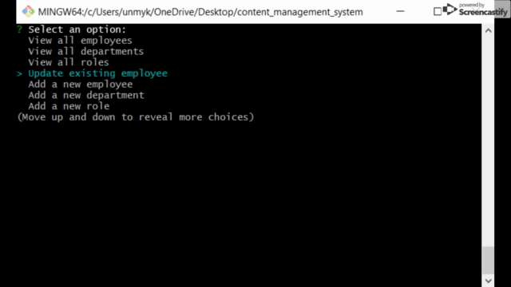
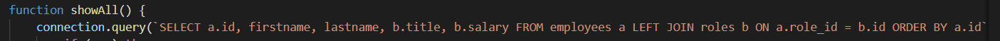

# content_management_system
A command line application to create, read, update, and delete employees in a MySQL database.

## Screen Grab 

GIF of CMS application in action. Displaying 'View all employees' function, then updating an existing employee and refreshing the employee list to show the changes made.

## Built With

* [JavaScript](https://javascript.com)
* [nodejs](https://nodejs.com)
* [MySQL](https://mysql.com)
* [Inquirer](https://npmjs.com/package/inquirer)

Code snippet showing the query for 'View all employees'. It selects specified fields from two tables in the database, joins them based in PK/FK, then orders the list by employee id numbers.

## Deployed Link

* [Github Repository Page](https://github.com/rev1311/content_management_system)

## Authors

* **Michael Partin** 

- [Link to Portfolio Site](https://rev1311.github.io/updated-portfolio/)
- [Link to Github](https://github.com/rev1311)
- [Link to LinkedIn](https://linkedin.com/in/michael-partin)

See also the list of [contributors](https://github.com/your/project/contributors) who participated in this project. HINT: Just me.

## Acknowledgments

* 

